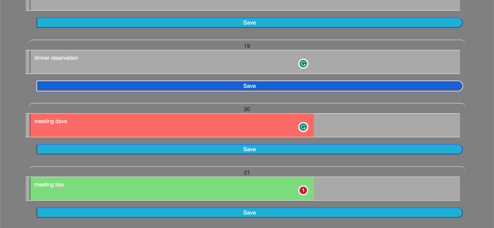

# work-schedule-project

This project is a tool for work-day scheduling, with dynamically updating timeblocks that change formatting depending on the time of day, and local storage to add tasks to each timeblock.

Getting the dynamically updated timeblocks to work was a big challenge but has been helpful in implementing similiar relationships in other projects.

The deployed code is accessible here: https://github.com/dylanadams98/work-schedule-project

The deployed page is accessible here: https://dylanadams98.github.io/work-schedule-project

